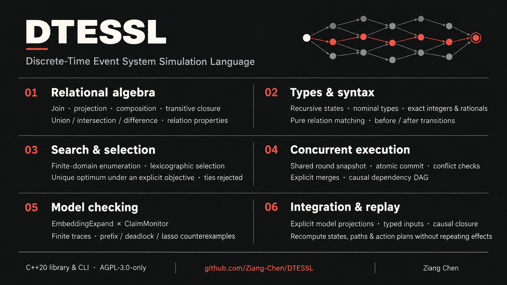

# DTESSL v0.4.8

[中文](README.md) | **English**



DTESSL (Discrete-Time Event System Simulation Language) models typed state,
transitions, causal history, and temporal properties. Its reference implementation
is a C++20 library and command-line tool with no third-party dependencies.

A model can describe a scheduler, a protocol, or several interacting automata.
The engine computes logical state changes and outbound action plans. A host
application executes those plans and supplies any results as subsequent typed inputs.

Licensed under [GNU AGPL version 3 only](LICENSE) (`AGPL-3.0-only`).
Copyright (c) 2026 Ziang-Chen. The grant includes historical versions, including
snapshots without a LICENSE file; see [licensing scope](LICENSING.md).
Commercial use is permitted subject to the license, including applicable source
availability obligations. Third-party material retains its own terms.

## Build and try it

Requirements: CMake 3.20 or newer and a compiler with C++20 support.
The following commands use a single-configuration build:

```sh
cmake -S . -B build -DDTESSL_BUILD_TESTS=ON
cmake --build build --target dtessl_cli dtessl_tests -j
ctest --test-dir build --output-on-failure
build/dtessl version
build/dtessl check examples/scheduler.dtessl
build/dtessl run examples/scheduler.dtessl Submit task=task-1 worker=worker-a
build/dtessl replay examples/scheduler.dtessl Submit task=task-1 worker=worker-a
build/dtessl repl examples/occurrence_capture.dtessl
```

For a multi-configuration generator, select a configuration when building and
testing, and use the executable in that configuration's output directory.

This small model is available in [examples/named_do.dtessl](examples/named_do.dtessl):

```dtessl
name TaskId
name OperationId

port worker.start(TaskId, OperationId)
port audit.accept(TaskId)

do StartTask(task: TaskId, operation: OperationId) @ worker [context=fixed, idempotent_by=(<task, operation>), result=consistent_by(<task, operation>), delivery=at_least_once, ordering=ordered_by(task), retry=safe, replay=suppress]:
  invoke: $worker.start(task, operation)

do RecordAccepted(task: TaskId) @ audit [context=fixed, delivery=at_most_once, retry=forbidden, replay=suppress]:
  append: $audit.accept(task)

state Idle @ scheduler initial:
  accepted: int = 0

state Busy @ scheduler:
  accepted: int = 0

transition Dispatch @ Submit(task: TaskId, operation: OperationId):
  <Idle @ scheduler, Busy @ scheduler> + (StartTask(task, operation), RecordAccepted(task)) [label=accept]:
    set @ scheduler:
      accepted = before.accepted + 1

procedure SchedulerRun @ local:
  initial (Idle @ scheduler)

trace Accepted:
  replay:
    inject Dispatch(TaskId(task_a), OperationId(operation_1)) @ SchedulerRun -> Dispatch.accept
  capture closed:
    transition (Dispatch.accept)
```

```sh
build/dtessl check examples/named_do.dtessl
build/dtessl trace examples/named_do.dtessl Accepted
```

`Dispatch` changes the scheduler from `Idle` to `Busy`, increments its counter,
and emits two ordered calls. The trace injects typed input and asserts that the
engine selects `Dispatch.accept`. The engine records the calls without invoking
the worker or audit service.

## Design and semantics

DTESSL separates static structure, dynamic state, relation matching, state
transitions, causal evidence, and external action plans. The equations below
describe the current design; they are neither a complete specification nor a
formal correctness proof. The cited papers supply theoretical background.
DTESSL's round, merge, capture, and ActionPlan rules are project-specific choices.

### 1. StateSchema and Embedding

Let $`S`$ be a recursive state schema and $`E_r=(C_r,V_r)`$ the Embedding at round $`r`$.
$`C_r`$ records active control branches; $`V_r`$ contains typed field values.

```math
E_r\in\mathrm{Valid}(S),\qquad
R_t(E_r,u,E')\in\{\mathrm{true},\mathrm{false}\}.
```

Here $`u`$ is a typed input occurrence and $`R_t`$ is a transition's before/after
relation. Each active choice axis selects one valid branch; nested axes become
active with their enclosing branch. A named state relation only matches the
current Embedding. Conjoining two templates means $`P(E_r)\land Q(E_r)`$: both
read the same state, with no intermediate update or attached effect.

### 2. Deterministic selection and atomic commit

Let $`K_t(E_r,u)`$ contain candidates admitted by control-state matching and
`where`. Without an optimizer, the engine requires $`|K_t|=1`$. With an explicit
exact-numeric score $`s`$, it requires a unique maximum:

```math
k^*\in\underset{k\in K_t(E_r,u)}{\mathrm{arg\,max}}\ s(E'_k),
\qquad
\left|\underset{k\in K_t(E_r,u)}{\mathrm{arg\,max}}\ s(E'_k)\right|=1.
```

No candidate or a tied maximum rejects the input. Selection is followed by merge
and invariant checks. Relation-value `select ... by lex(...)` has a different
direction: it chooses the unique smallest score tuple in ascending order.

All inputs in a round's bag $`B_r`$ read the same before snapshot:

```math
E_{r+1}=\mathrm{Apply}\!\left(E_r,
\mathrm{Merge}\{\Delta_k(E_r,u):u\in B_r\}\right).
```

Commit requires successful admission for every input, a defined merge, and valid
resulting invariants. Multiple writes to one field are rejected by default.
`merge equal` requires equal values; `merge union` unions supported set values.
Failure preserves $`E_r`$ and produces no accepted action plan. Source order and
hash iteration order never break a tie.

### 3. Causal order and rounds

Lamport's happened-before relation is a partial order rather than an ordering
that requires a physical clock.
[Lamport, 1978](https://www.microsoft.com/en-us/research/wp-content/uploads/2016/12/Time-Clocks-and-the-Ordering-of-Events-in-a-Distributed-System.pdf).
For DTESSL, let $`D`$ contain direct field and control-state-axis dependency edges,
and let $`D^+`$ be its transitive closure:

```math
a\prec b\iff(a,b)\in D^+,\qquad
a\parallel b\iff\neg(a\prec b)\land\neg(b\prec a)\quad(a\ne b).
```

Decisions in one atomic batch share a `RoundId`. A smaller round number alone
does not establish a causal dependency between two occurrences. Calls within
an ActionPlan have their own dependency DAG, distinct from the occurrence DAG.

### 4. Claims and the monitor product

Automata-based verification connects property checking to a combination of
execution and property automata. See
[Vardi and Wolper, 1986](https://www.cs.rice.edu/~vardi/papers/lics86.pdf) and
[SPIN's theoretical background](https://spinroot.com/spin/theory.html).
An explanatory model of DTESSL's construction is:

```math
\mathcal P=\mathrm{EmbeddingExpand}\times\mathrm{ClaimMonitor},\qquad
(E,q)\longrightarrow(E',\delta(q,L(E,u,E'))).
```

$`q`$ is monitor state and $`L`$ supplies observations of the logical step. Monitor
state stays separate from the user's StateSchema. The Solver explores reachable
product nodes on demand for finite-prefix, deadlock, or lasso counterexamples.
Unsupported fragments and exhausted search budgets must not be reported as
proofs; they retain an `inconclusive` result.

For a closed finite trace $`\pi=E_0\ldots E_n`$, basic temporal operators read:

```math
\pi,i\models\mathbf F p\iff\exists j\in[i,n]:\pi,j\models p,\qquad
\pi,i\models\mathbf G p\iff\forall j\in[i,n]:\pi,j\models p.
```

Here $`0\le i\le n`$, including the initial state. The finite-trace interpretation
is grounded in [De Giacomo and Vardi, 2013](https://www.ijcai.org/Proceedings/13/Papers/132.pdf).
An open trace remains `pending` without decisive evidence. A projection with
causal gaps cannot establish an unconditional positive result. DTESSL does not
claim to implement the paper's full LDLf language.

### 5. Capture and replay

Let $`A`$ be occurrence seeds selected by state, transition, or procedure filters.
With $`\mathrm{Pred}`$ denoting explicit causal predecessors, the base
causal closure is the least fixed point:

```math
\mathrm{CausalClosure}(A)
=\mu X.\left(A\cup\mathrm{Pred}(X)\right).
```

An `eventually` capture also retains the interval from each anchor to its first
witness. Procedure labels provide grouping; they do not pull every unrelated
occurrence of that procedure into a capture.

The visible selection differs from replay input. A `TraceArtifact` preserves the
typed input prefix from the initial state through the last selected round. The
same core recomputes paths, Embeddings, causal edges, and ActionPlans from this
prefix. `capture projected` is observational and cannot be replayed.

### 6. Logical changes and external effects

```math
\mathrm{Step}(E_r,B_r)=(E_{r+1},A_r,H_r),\qquad
A_r=\mathrm{Lower}(E_r,E_{r+1},\mathrm{bindings}).
```

This equation describes an accepted step: $`A_r`$ is the outbound ActionPlan and
$`H_r`$ is logical history evidence. The core emits plans without invoking external
providers. Idempotency, retry, and delivery annotations are contracts the host
must fulfill. Nondeterministic results enter through later typed inputs rather
than the current after-state. Replay reinjects recorded input and recomputes
plans without repeating physical effects.

Further detail: [research references](docs/REFERENCES.md),
[language design](docs/LANGUAGE_DESIGN.md), and [roadmap](docs/ROADMAP.md).

## Language guide

| Construct | Role |
|---|---|
| `record`, `variant`, `enum`, `newtype`, `name` | Typed values and nominal identities |
| `state` and nested `case` | Recursive schema, control axes, fields, and invariants |
| `relation` | Finite relations, derived plans, and pure matching templates |
| `transition` | Admitted before/after changes and associated action plans |
| `procedure` | A persistent automaton instance with initial states and context |
| `trace` | Declared input, capture, and replay evidence |
| `Claim` | Temporal and relation properties checked by monitors and Solver |

### States, patterns, and relations

The structured and compact forms lower to the same typed AST. For example:

```dtessl
state Switch @ local = Mode(Off | On(Level(Low | High))), Health(Good | Failed), changes: int = 0;
```

Commas conjoin structure, `|` selects alternatives, and nested parentheses express
containment. `<...>` is an ordered product; `{...}` is an unordered collection.
`subject ~ relation` performs typed relation matching. Ordinary matching does
not introduce implicit search: enumeration belongs to `E`, `A`, `select`, and
explicit finite parameter domains. Comparisons and relation matches share the
same typed validation and evaluation rules across guards, invariants, and claims.

Named state relations contain current-state patterns and pure `where` predicates.
The expression `Admit, Authorized | Trusted` means
`(Admit and Authorized) or Trusted`, all evaluated against one before Embedding.
The transition owns its target state, `set`, `do`, and `ensure` clauses.

The compact syntax also supports one-line state and transition declarations:

```dtessl
state a, b, c;
trans ctodo: a -> b when b.val == 0;
trans ctodo: a -> c when b.val != 0;
procedure p1 a, b.val = 0, c & inject ctodo;
trace @procedure;
```

Each compact declaration ends with `;` on the same physical line. Repeated named
`trans` declarations are alternatives within one family. Connected transition
nodes form control axes, and the procedure initializes them. Indented syntax uses
spaces; tabs are rejected. `//` begins a line comment.

### Values and finite search

The value system includes `bool`, arbitrary-precision `int`, normalized
`rational`, UTF-8 `string`, nominal values, and recursive
`list/set/map/bag/option/result` containers. Integer division produces a rational;
mixed numeric operations preserve exactness. Canonical ordering makes collection
enumeration and serialization reproducible.

`[T]`, `[]`, and `[value]` are option syntax; lists use `list[...]`. A `name`
declaration creates nominal logical identities such as `TaskId(task_a)`.
Pattern matching checks constructor coverage, payload types, and result types.
Pure functions are nonrecursive and read their parameters.

Finite relations support projection, joins, products, composition, inverse,
closure, union, intersection, difference, domain/range, image/preimage, and
properties such as functionality, acyclicity, and partial order. Derived
RelationPlans can be inspected and used as Claim targets.

`select row ~ r where p by lex(score...)` returns a typed option. No candidate
returns `none`; equal best score tuples reject the round. Include a stable ID
as the final score component when that is the intended tie-breaking rule.
`exists` returns only a Boolean and does not expose a selected binding to `do`.

### Transition selection and actions

A source state set is conjunctive. Alternative cases provide candidate routes.
Source patterns may use finite alternatives or wildcards; targets are exact.
`where` admits a route, `set` computes its update, and `ensure` activates temporal
obligations on the successor. Named cases give stable identities for capture and
replay assertions.

`optimized_score` permits multiple admitted paths only with a unique greatest
exact integer or rational score evaluated on each proposed after-state. See
[the optimizer example](examples/optimized_transition.dtessl).

In an action expression, `,` adds serial dependencies and binds more tightly than
`|`. Thus `a, b | c, d` means two parallel chains, while `a, (b | c)` runs `a`
before both `b` and `c`. Named `do` definitions provide reusable typed plans.
Their contract fields cover context, idempotency keys, results, delivery,
ordering, retry, and replay policy. Each emitted call carries its contract.

`@context` resolves model names or routes calls; it grants no authority.
`result=nondeterministic` requires `replay=reinject`: a recorded result is later
supplied as typed input, without calling the provider again during replay.

### Procedures, traces, and the REPL

RuntimeContext retains each procedure's active states, typed values, revision,
pending injections, and causal frontier. Named injection addresses a
TransitionId, then the engine searches by active-state signature and guard.
Procedure-local anonymous transitions are automaton edges, not ordered steps.

In a declared trace, `replay:` precedes `capture:`. A replay line represents one
round; `|` separates same-round injections. An optional `-> Transition.case`
checks the derived route rather than selecting it. Closed capture can operate
on free occurrences as well as procedure-labelled occurrences.

Accepted decisions record immutable typed input, before/after values, and the
derived plan. `captured_round_at` and `captured_procedure_at` query this evidence.
State capture seeds match entering and leaving decisions. Transition and
procedure seeds join the selection by union. Distributed `[capture=Trace/Session]`
annotations feed the same capture model; without an explicit closed template,
their generated trace is projected and non-replayable.

Try this after opening the occurrence example in the REPL:

```text
:trace StartUntilDone
:replay-artifact StartUntilDone
:reset
:step Start
:step Progress
:trace-live StartUntilDone
:step Finish
:step After
:trace-live StartUntilDone close
:replay-artifact StartUntilDone live
```

The first witness closes the `Start`-to-`Done` interval and excludes the later
`After` occurrence. `:step` uses exact TransitionId admission. `:trace` evaluates
declared traces; `:trace-live` observes the current engine. Persistent procedures
also support `:start`, `:inject`, `:runtime`, and `:capture`. The compatibility
`ProcedureArtifact` is a view of labelled occurrences, not a separate closure rule.

### Validation and implementation limits

Static checks validate types, initial control-state choices, event signatures,
fields, predicates, assignments, and call arguments. Invalid invariants, ambiguous
selection, conflicting updates, and duplicate call labels are errors. Canonical
output orders collections, calls, and dependency edges consistently. Replay
recomputes and compares logical results, including ActionPlans.

The current implementation is a C++20 reference interpreter with a built-in
Solver, discrete rounds, and exact arithmetic. Model checking is limited by
supported temporal fragments and search budgets. Actual I/O and effects belong
to the host. A generated operational mirror checks an explicitly supplied model
projection; it does not constitute independent assurance of the external system.

## More commands and documentation

```sh
build/dtessl features examples/scheduler.dtessl
build/dtessl plans examples/relations.dtessl
build/dtessl highlight examples/scheduler.dtessl
build/dtessl bench examples/encoding/stage1_dense_state/ring_32.dtessl Advance 10000
build/dtessl verify-claim examples/claims/safety_counterexample.dtessl NoFailure
build/dtessl claims examples/temporal_trace.dtessl History
build/dtessl verify-claim examples/temporal_procedure.dtessl StartedSinceDone
build/dtessl replay examples/core_logic.dtessl Submit minimum=2
build/dtessl replay-batch examples/scheduler.dtessl \
  Submit task=task-1 worker=worker-a -- Note text=same-round
build/dtessl descriptor-check examples/scheduler.semantic
build/dtessl descriptor-generate examples/scheduler.semantic
build/dtessl descriptor-source-map examples/scheduler.semantic
build/dtessl descriptor-manifest examples/scheduler.semantic
build/dtessl descriptor-replay examples/scheduler.semantic Submit minimum=1 task=task-1
```

`SemanticDescriptor v1` records provenance, source mappings, descriptor/source
digests, coverage, and gaps for an explicit model projection supplied by another
system. Generated calls must use declared, type-checked ports.

Versions follow the project's `milestone.major-feature.minor-feature` convention,
not SemVer. See [versioning](docs/VERSIONING.md).

- [Language design](docs/LANGUAGE_DESIGN.md) and [core syntax](docs/CORE_LOGIC_SYNTAX.md)
- [State choices and finite domains](docs/STATE_CASE_AND_FINITE_DOMAINS.md)
- [Canonical values](docs/CANONICAL_VALUE_V1.md) and [exact numerics](docs/EXACT_NUMERIC_PROFILE_V1.md)
- [Relations and search](docs/RELATION_SEARCH_V1.md) and [Solver](docs/SOLVER.md)
- [Backends](docs/BACKENDS.md) and [semantic descriptors](docs/SEMANTIC_DESCRIPTOR_V1.md)
- [Language service and REPL](docs/LANGUAGE_SERVICE.md)
- [Research references](docs/REFERENCES.md), [roadmap](docs/ROADMAP.md), and [changelog](CHANGELOG.md)
